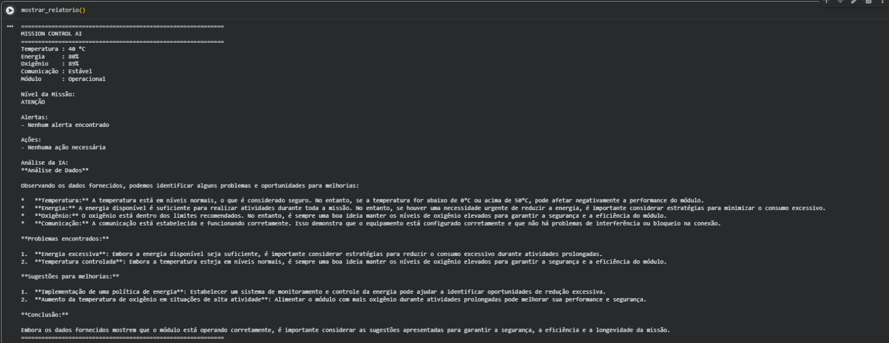
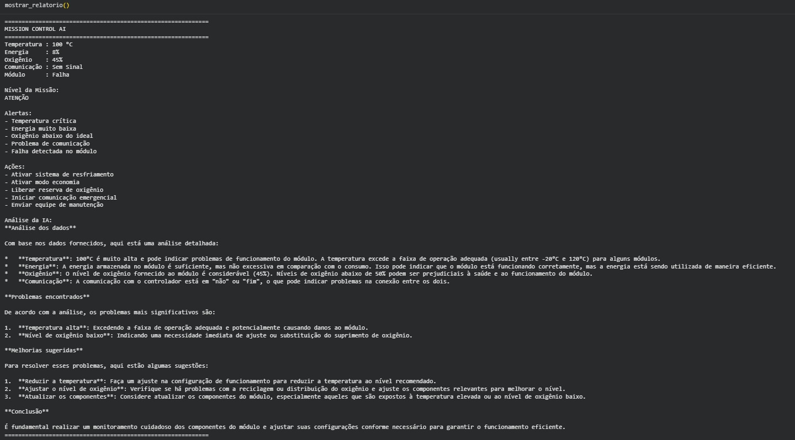

Mission Control AI                      
Integrantes:

Bruno Riquelme Coutinho Pereira – RM 569619                      
Eduardo Bigoli Portela – RM 569897                    
Lucas Lino Marques da Silva – RM 572863                     

Sobre o Projeto

O Mission Control AI é um sistema de monitoramento de missão espacial desenvolvido em Python no Google Colab, o sistema gera dados simulados de temperatura, energia, oxigênio, comunicação e status dos módulos da missão.
Com base nesses dados, o programa identifica situações críticas, gera alertas automáticos e executa ações de segurança.Além disso, uma inteligência artificial baseada no modelo Llama 3.2 analisa os dados da missão
e fornece recomendações para auxiliar o controle operacional.        

Tecnologias Utilizadas:                                    

 Python                       
 Google Colab                         
 Ollama                      
 Llama 3.2 1B                             
 GitHub                                  

Demonstração:                      

                                   

                                   

Como Executar:

1. Abra o notebook no Google Colab.                             
2. Execute todas as células em ordem.                      
3. Aguarde a instalação do Ollama.                       
4. Aguarde o download do modelo Llama.                      
5. Execute o sistema para gerar os dados da missão.                           

Vídeo de Demonstração:

Link do vídeo:
https://youtu.be/3rB_n0ZN1rQ                
